# Credit_Risk_Analysis
## Overview
In this analysis I applied  machine learning methods to evaluate the credit risk of different applicants. I used these methods to compare and determine which method would best predict if an applicant is considered good or bad. 
## Results
### Naive Random Oversampling 
* The balanced accuracy score is .67. This means that the model made correct predictions about the riskiness of the loan applications 67% of the time. 
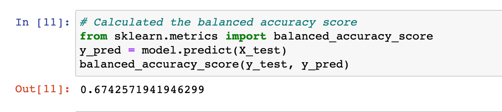
* Precision: .99
  * This means the model is 99%  reliable in predicting positive classifications. 
* Recall: .61
  * This means that when the classification is positive, the model accurately predicted that it was positive 61% of the time
  * 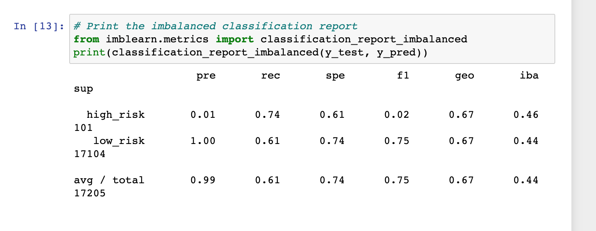
### SMOTE Oversampling
* The balanced accuracy score is .66. This means that the model made correct predictions about the riskiness of the loan applications 66% of the time. 
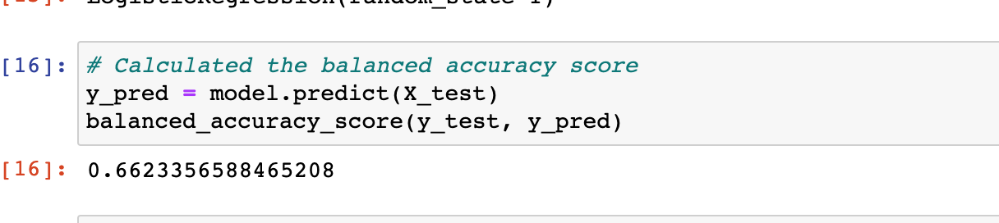
* Precision: .99
  * This indicates the model is 99% reliable in predicting positive classifications. 
* Recall: .69
  * This indicates that when the classification is positive, the model correctly predicts the riskiness of the loan applications 69% of the time. 
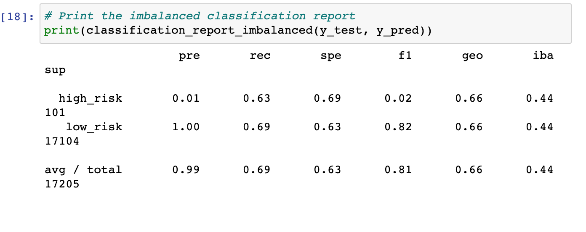
### ClusterCentroids resampler
* The balanced accuracy score is .544 which means the model is correct about the riskiness of applications 54% of the time.
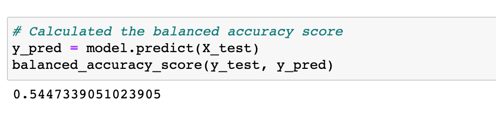
* Precision: .99
  * The model is 99% reliable in predicting positive classifications. 
 * Recall: .40
  * Of the positive classifications, the model predicts that they are positive 40% of the time. 
 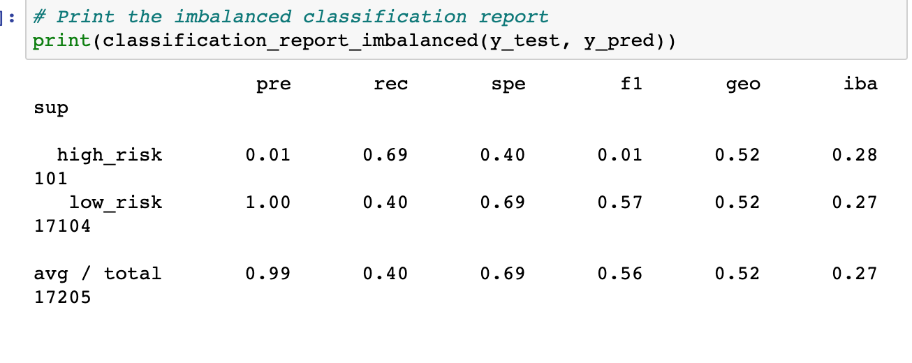
 ### SMOTEEN 
 * The balanced accuracy score is .54. This means the model made predictions about the riskiness of the loan applications 54% of the time. 
 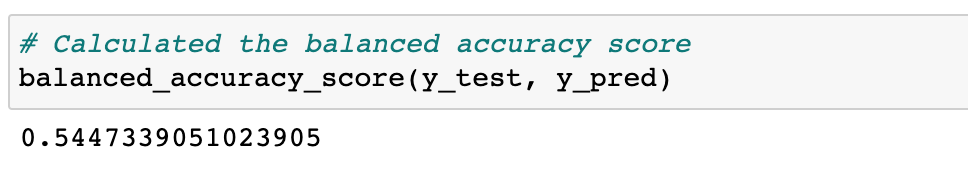
 * Precision: .99
  * This indicates that the model is 99% reliable in predicting positive classifications. 
 * Recall: .59
  * Of the positive classifications, the model predicts they are positive 59% of the time. 
 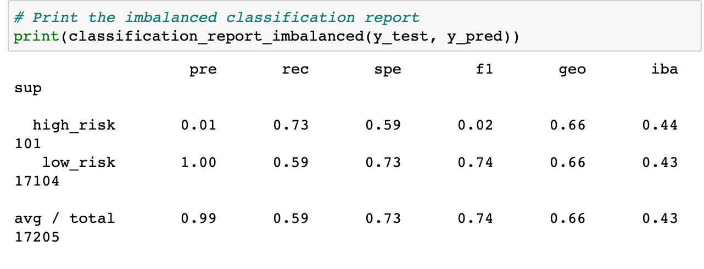
 ### Balanced Random Forest Classifier
* The balanced accuracy score is .78. This means the model accurately made correct predictions about the riskiness of the loan applications 78% of the time. 
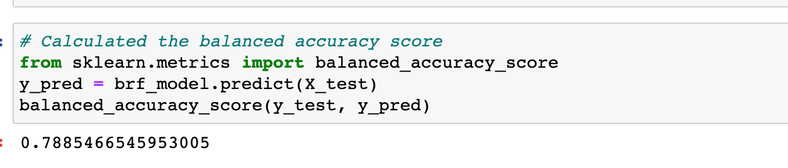
* Precision: .99
  * This indicates the model is 99% reliable in predicting positive classifications. 
 * Recall: .87
  * Out of the positive classifications, the model predicts they are positive 87% of the time. 
 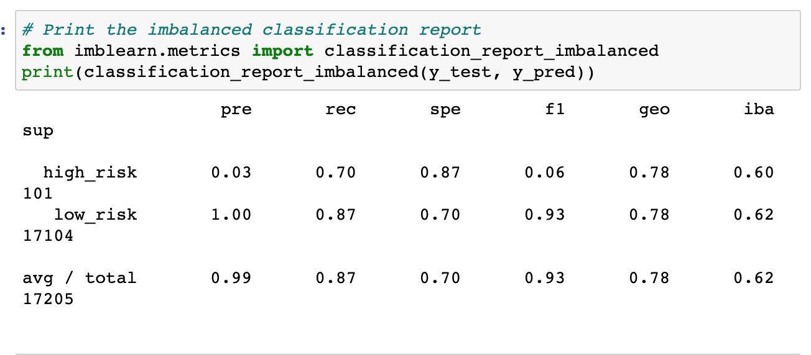
 ### Easy Ensemble 
 * The balanced accuracy score is .93. This means that the model is correct about the riskiness of applications of 93% of time 
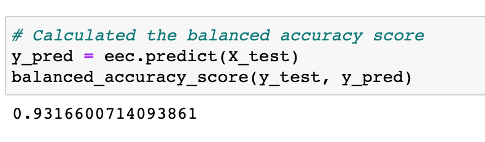
* Precision: .99
  * This indicates the model is 99% reliable in predicting positive classifcations. 
 * Recall:.94
  * This indicates that out of the positive classifications, the model predicted that they were positive 94% of thet time. 
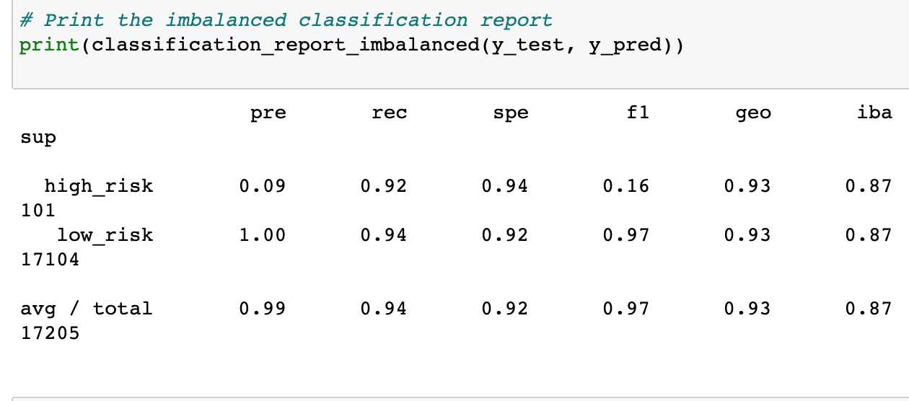
## Summary
All models had a precision score of .99. The easy ensemble classifier had the highest balanced accuracy score, .93, and the highest recall score, .94. This method provided the most accurate way to predict the riskiness of applications, and is the one I would recommend using. 
